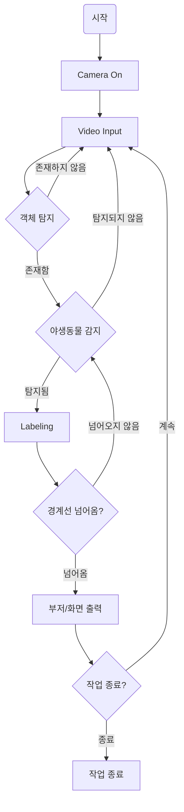

# EE2 수업 역할 분담

## 1. 역할 분담 내용
구현해야 하는 기능
- 어떻게 input -> 내장 카메라 ? 혹은 그냥 영상 ?
    * 코드상에서 PIL -> opencv 도 있고 -> Jetson 을 쓴다 (remote (ssh))

### 이관호 (SCV)
1. 주업무 
    - motion detecting, Dataset(동물 구분하는 알고리즘 작성) => model 훈련 (Github 방장)
2. 부업무
    - 코드작성 (피드백 수용 -> 그때그때 알잘딱)

### 김진구 (코드 피드백)
1. 주업무 
    - 알고리즘 올바르게 동작하는지 피드백 -> 개선점 제시 (코드의 개선)
    - 전반적인 프로젝트 진행 방향 관리 -> Flag
2. 부업무 
    - 팀원들의 프로젝트가 주제의 방향성과 맞는지 검사 -> 피드백
    - 자산 운용 

### 박준영 (프로젝트 매니저) (프로젝트 자체에 대한)
1. 주업무
    - 프로젝트에서 뭔가 더 필요할거같다 -> 명령 하달
    - 팀원들의 프로젝트가 주제의 방향성과 맞는지 검사 -> 피드백
2. 부업무 
    - Model 학습

## 순서도

